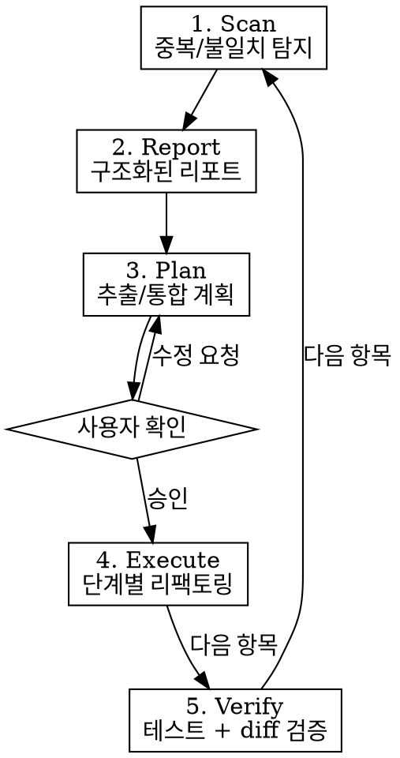

# Architecture Refactor

전체 코드베이스 아키텍처를 분석하고, 크로스 모듈 중복을 탐지하여, 단계별로 리팩토링을 실행한다.

## Workflow



## Phase 1: Scan

대상 범위를 정하고 (특정 디렉토리, 모듈 쌍, 또는 전체) 아래 규칙으로 스캔한다.

### Detection Rules

| ID | 규칙 | 탐지 방법 |
|----|------|-----------|
| DUP-FN | 동일/유사 함수가 2개 이상 모듈에 존재 | 함수명 grep → 본문 비교 |
| DUP-CONST | 같은 이름/값의 상수가 복수 파일에 선언 | const 선언 grep → 값 비교 |
| DIV-CONST | 같은 개념의 상수가 다른 값으로 존재 | 의미적 비교 (의도적 차이 vs 동기화 누락) |
| DUP-STATE | 동일 구조의 모듈 레벨 상태(Map, Object)가 복수 파일에 존재 | `new Map()` / `= {}` 선언 패턴 |
| DUP-PIPE | 동일 로직 파이프라인이 인라인으로 복사됨 (가드, 필터 체인 등) | 10줄 이상 연속 유사 블록 |
| RECOMP | 같은 인자로 같은 함수를 한 실행 경로에서 2회 이상 호출 | 호출 사이트 추적 |
| IMPORT-GAP | 모듈 A가 모듈 B를 이미 import하는데 B의 로직을 인라인 복사 | import 그래프 vs 인라인 코드 비교 |
| API-SHAPE | 거의 동일한 API 응답 shape를 반환하는 함수가 복수 존재 | export 함수 반환 구조 비교 |

### Scan 실행 방법

1. **Import 그래프 수집**: 대상 모듈들의 import/export 관계 매핑
2. **함수 목록 수집**: 모든 named export + 로컬 함수 목록
3. **크로스 매칭**: 모듈 쌍 간 동일/유사 함수명 탐지
4. **본문 비교**: 매칭된 함수의 로직 동일성 판단
5. **상수/상태 비교**: 같은 이름의 const, Map, Object 비교
6. **호출 빈도 분석**: 비용이 큰 함수(DB 쿼리, API 호출, 무거운 계산)의 호출 횟수 집계

## Phase 2: Report

스캔 결과를 아래 형식으로 보고한다.

```markdown
## Architecture Audit Report

### 1. 동일 함수 (DUP-FN)
| 함수 | 파일 A (라인) | 파일 B (라인) | 동일도 | 추출 가능 |
|------|--------------|--------------|--------|----------|

### 2. 동일 상수 (DUP-CONST)
| 상수명 | 파일 A | 파일 B | 값 일치 | 비고 |
|--------|-------|-------|---------|------|

### 3. 불일치 상수 (DIV-CONST)
| 상수명 | 파일 A 값 | 파일 B 값 | 의도적? | 위험도 |
|--------|----------|----------|---------|--------|

### 4. 중복 파이프라인 (DUP-PIPE)
| 로직 블록 | 파일 A (라인) | 파일 B (라인) | 라인 수 | 추출 난이도 |
|-----------|--------------|--------------|---------|------------|

### 5. 재계산 (RECOMP)
| 함수 | 호출 경로 | 호출 횟수 | 절약 가능 |
|------|----------|----------|----------|

### Summary
| 카테고리 | 건수 | 영향 파일 수 | 추정 제거 라인 |
|----------|------|-------------|---------------|
```

## Phase 3: Plan

리포트 기반으로 리팩토링 계획을 수립한다.

### 계획 원칙

1. **안전 우선**: 순수 함수/상수 추출부터 시작 (부작용 없는 것 먼저)
2. **한 번에 하나**: 각 단계는 독립적으로 테스트 가능해야 함
3. **의존 순서**: 공유 모듈 생성 → import 변경 → 인라인 코드 제거
4. **기존 테스트 통과 필수**: 리팩토링은 동작을 보존해야 함
5. **의도적 차이 보존**: DIV-CONST가 의도적이면 주석으로 이유를 남기고 유지

### 추출 대상 분류

```
[즉시 추출 가능 — 리스크 없음]
├── 순수 헬퍼 함수 (입력→출력, 부작용 없음)
├── 상수 테이블 (변경 안 되는 값)
└── 타입/enum 정의

[조건부 추출 — 테스트 확인 필요]
├── 모듈 상태를 참조하는 함수
├── config 의존 로직
└── 외부 API 호출을 포함하는 로직

[추출 보류 — 큰 리팩토링 필요]
├── 100줄 이상 인라인 파이프라인 (가드 체인 등)
├── 이벤트/콜백 기반 로직
└── 모듈별 의도적 분기가 혼재된 블록
```

### 공유 모듈 배치 규칙

- 두 모듈이 대등하게 공유: 상위 `shared/` 디렉토리에 배치
- 한 모듈이 폐기 예정: 남는 모듈 디렉토리에 배치하고, 폐기 모듈이 import
- 파일명은 역할 기준: `helpers.js`, `constants.js`, `guards.js` 등

### 계획서 형식

```markdown
## Refactoring Plan

### Step 1: [제목]
- **대상**: 파일명:라인 → 새 파일명
- **작업**: 추출/이동/통합/삭제
- **의존**: 없음 / Step N 완료 후
- **검증**: [프로젝트 테스트 명령어]

### Step 2: ...
```

**반드시 사용자 확인을 받은 후 실행으로 진행한다.**

## Phase 4: Execute

승인된 계획을 단계별로 실행한다.

### 테스트 명령어 감지

프로젝트의 테스트 러너를 자동 감지한다:
- `package.json` → `scripts.test` 확인 (vitest, jest, mocha 등)
- `pyproject.toml` / `setup.cfg` → pytest 확인
- `Makefile` / `Cargo.toml` / `go.mod` → 해당 언어 테스트 러너
- CLAUDE.md에 테스트 명령어가 명시되어 있으면 우선 사용

### 단계별 실행 규칙

1. **한 Step씩 실행** → 테스트 → 다음 Step
2. 새 공유 모듈 생성 시: 파일 생성 → export 확인 → 소비자 import 변경 → 원본 삭제
3. 함수 이동 시: 새 위치에 복사 → 원본을 re-export로 변경 → 모든 소비자 확인 → 원본 re-export 제거
4. **원본 삭제 전 반드시 grep으로 잔여 참조 확인**
5. 각 Step 완료 후 테스트 실행하여 전체 통과 확인

### 변경 시 금지 사항

- 리팩토링과 동시에 로직 변경 금지 (동작 보존)
- 기존 export를 제거할 때 외부 소비자 확인 없이 삭제 금지
- 테스트 실패 상태에서 다음 Step 진행 금지

## Phase 5: Verify

모든 Step 완료 후 최종 검증한다.

1. **전체 테스트 실행**
2. **import 그래프 재확인**: 순환 의존 없는지 확인
3. **제거된 중복 확인**: Phase 1 규칙으로 재스캔하여 해결된 항목 체크
4. **잔여 항목 목록**: 아직 남은 중복/불일치를 다음 리팩토링 대상으로 기록

## Common Mistakes

| 실수 | 대응 |
|------|------|
| 함수 이동하면서 로직도 같이 수정 | 리팩토링은 동작 보존만. 로직 변경은 별도 커밋 |
| 공유 모듈에 모듈별 분기 추가 | 공유 모듈은 모듈 무관한 순수 로직만 포함 |
| 의도적 차이를 실수로 통합 | DIV-CONST는 반드시 이유를 확인하고 주석 남김 |
| 한 번에 모든 중복 제거 시도 | Step 단위로 나누어 각각 테스트 |
| 테스트 없이 re-export 제거 | grep으로 잔여 참조 확인 + 테스트 통과 후 제거 |
